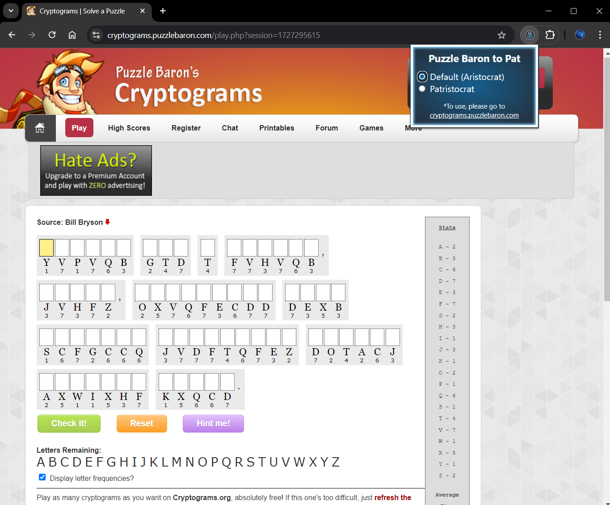
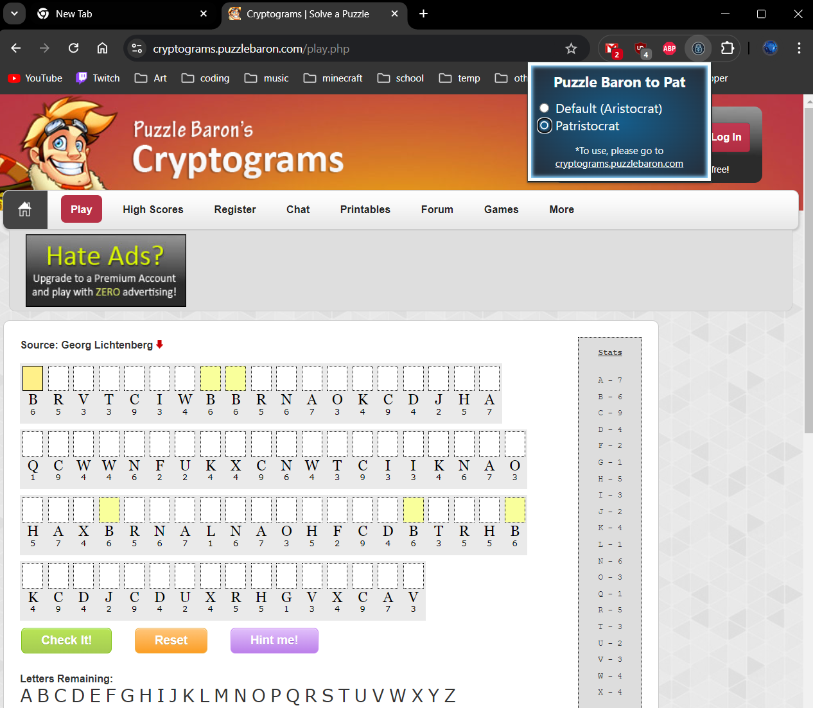

# Puzzle Baron Patristocrat Extension

## How to install
- Code > Download Zip > Unzip File
- In Chrome: Three Dots > Extensions > Manage Extensions
- Turn on "Developer Mode" in top right corner
- Load Unpacked
- Select "CodebustersPatExtension" Folder
- You should see it under "All Extensions"!
    
## Features
On https://cryptograms.puzzlebaron.com/play.php click the extension and toggle whether spaces and punctuation appear in the puzzle

## Demo

## About
During the 2023-2024 season, my high school Science Olympiad team was looking for resources to help practice for the "Codebusters" event (a timed code cracking event). One type of code, "Aristocrats" (aka cryptograms) already had a very nice practice website: <a href="https://cryptograms.puzzlebaron.com/">Puzzle Baron</a>. However, another type of code, "Patristocrats" (Aristocrats without spaces and punctuation) has no resources online. To help this, I created this quick Chrome extension to edit the HTML/CSS of the site to hide this information. Apparently it was useful, because the team placed 2nd in the state in that event!
