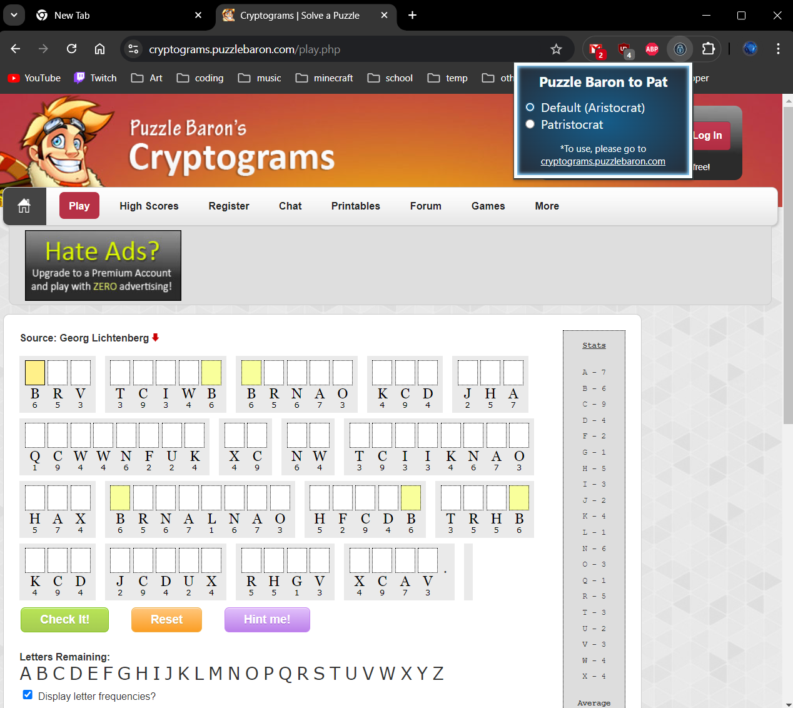

# Puzzle Baron Patristocrat Extension

## How to install
- Code > Download Zip > Unzip File
- In Chrome: Three Dots > Extensions > Manage Extensions
- Turn on "Developer Mode" in top right corner
- Load Unpacked
- Select "CodebustersPatExtension" Folder
- You should see it under "All Extensions"!
    
## Features
On https://cryptograms.puzzlebaron.com/play.php click the extension and toggle whether spaces and punctuation appear in the puzzle

## Demo

## About
